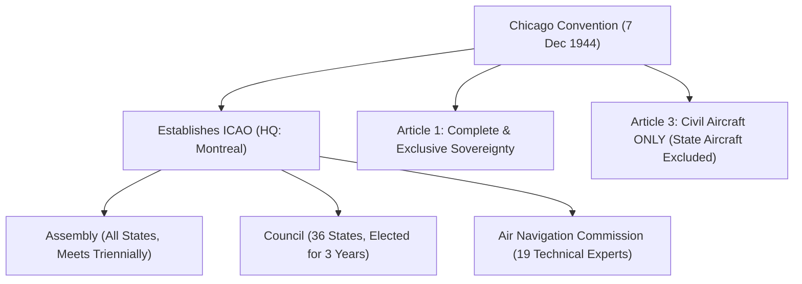
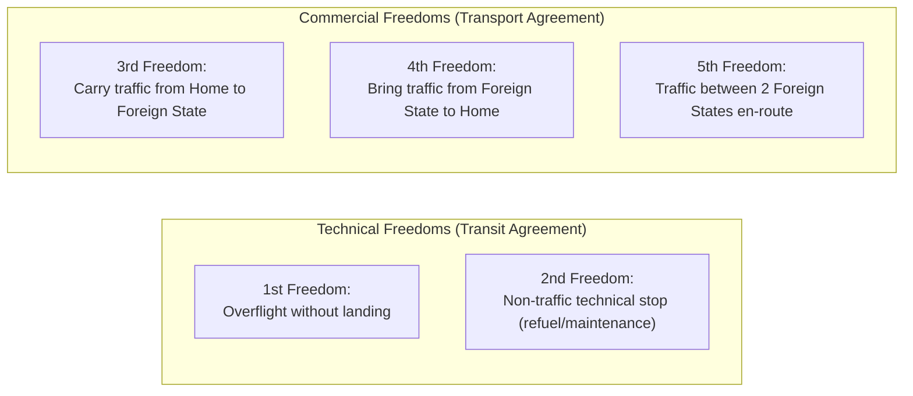

# 010 Air Law | Chapter 1: International Agreements & Organizations

| Document Data | Specification |
| :--- | :--- |
| **Subject** | 010 Air Law (EASA ATPL) |
| **CAE Oxford Manual** | Chapter 1 (Pages 21 – 52) |
| **Difficulty Level** | 🔴 High (Heavy legal terminology, exact articles, strict exam traps) |
| **Exam Weighting** | ⭐⭐⭐ Critical (Guaranteed questions on every AviationExam sitting) |
| **Target Score** | ≥ 90% in AviationExam Mock Tests |
| **PDF Summary File** | [`010_ch01_international_agreements.pdf`](file:///Users/fernandochozasaliseda/Desktop/PROYECTO%20ATPL/resumenes/convocatoria_1/010_air_law/010_ch01_international_agreements.pdf) |

---

## 1. The Chicago Convention on International Civil Aviation (1944)

The Chicago Convention was signed on **7 December 1944** in Chicago by 52 States, and formally entered into force on **4 April 1947** following ratification by 26 States. It established the modern legal and technical framework for international civil aviation and created the **International Civil Aviation Organization (ICAO)**.

### Purpose of the Convention
* Foster the planning and development of international air transport so as to ensure the safe and orderly growth of international civil aviation throughout the world.
* Encourage the development of airways, airports, and air navigation facilities.
* Meet the needs of the peoples of the world for safe, regular, efficient, and economical air transport.
* Prevent economic waste caused by unreasonable competition.
* Ensure that the rights of Contracting States are fully respected and that every Contracting State has a fair opportunity to operate international airlines.

---

## 2. Key Articles of the Chicago Convention (EASA Exam Essentials)

The ECQB and AviationExam repeatedly test the specific article numbers. Memorize this table thoroughly:

| Article | Concept / Title | Official EASA Rule & Exam Pitfalls |
| :---: | :--- | :--- |
| **Art. 1** | **Sovereignty** | Every State has **complete and exclusive sovereignty** over the airspace above its territory (including territorial waters). |
| **Art. 2** | **Territory** | Land areas and adjacent territorial waters under the sovereignty, suzerainty, protection, or mandate of a State. *(The High Seas are NOT territory of any State)*. |
| **Art. 3** | **Civil vs State Aircraft** | Applies **SOLELY to civil aircraft**. Aircraft used in **military, customs, and police** services are deemed **State aircraft**. State aircraft may not fly over or land without special agreement. |
| **Art. 4** | **Misuse of Civil Aviation** | Contracting States agree not to use civil aviation for any purpose incompatible with the aims of the Convention. |
| **Art. 5** | **Non-scheduled Flights** | Civil aircraft not engaged in scheduled international services have the right to make flights into or in transit non-stop across territory and to make stops for non-traffic purposes without prior permission. |
| **Art. 6** | **Scheduled Air Services** | No scheduled international air service may be operated over or into the territory of a Contracting State without special permission or authorization. |
| **Art. 7** | **Cabotage** | Each Contracting State has the right to **refuse permission** to aircraft of other States to take on passengers, mail, and cargo carried for remuneration between points within its territory. States agree not to grant cabotage on an exclusive basis. |
| **Art. 8** | **Pilotless Aircraft** | No aircraft capable of being flown without a pilot (UAV / Drone) shall be flown without special authorization and control to avoid danger to civil aircraft. |
| **Art. 9** | **Prohibited Areas** | A State may restrict or prohibit aircraft from flying over certain areas for military necessity or public safety, provided no distinction is made between its own and foreign aircraft. |
| **Art. 10** | **Customs Airport Landing** | States may require that aircraft entering their territory land at an airport designated as a customs airport for customs/immigration clearance. |
| **Art. 11** | **Applicability of Air Regulations** | National laws and regulations regarding entry, clearance, and air navigation must be applied to aircraft of all Contracting States without distinction as to nationality. |
| **Art. 12** | **Rules of the Air** | Each State ensures aircraft flying over its territory comply with national rules. **Over the High Seas, ICAO Rules of the Air apply without exception.** |
| **Art. 13** | **Entry and Clearance Regulations** | Aircraft and passengers/crew must comply with laws regarding entry, clearance, immigration, passports, customs, and quarantine. |
| **Art. 16** | **Search of Aircraft** | Competent authorities of a State have the right to search aircraft of other States upon landing or departure without causing unreasonable delay. |
| **Art. 22 & 23** | **Facilitation** | States agree to adopt all practicable measures to facilitate air navigation and prevent unnecessary delays (customs, immigration). |
| **Art. 24** | **Customs Duty** | Aircraft on a flight to, from, or across another State are admitted temporarily free of duty. **Fuel, lubricating oils, spare parts, and regular equipment** on board are exempt from customs duty upon arrival. |
| **Art. 25** | **Aircraft in Distress** | Duty of each State to provide assistance to aircraft in distress in its territory and permit owners/authorities to provide assistance. |
| **Art. 26** | **Accident Investigation** | When an accident occurs involving death, serious injury, or serious technical defect, the **State of Occurrence** conducts an inquiry according to ICAO procedure. The **State of Registry** is permitted to appoint observers. |
| **Art. 29** | **Documents Carried on Aircraft** | Every aircraft engaged in international navigation must carry: 1) Certificate of Registration, 2) Certificate of Airworthiness, 3) Crew Licences, 4) Journey Log Book, 5) Aircraft Radio Station Licence, 6) Passenger Manifest (if carrying pax), 7) Cargo Manifest. |
| **Art. 30** | **Radio Equipment** | Aircraft may carry radio apparatus only if licensed by the State of Registry. Radio equipment must be operated by crew holding licences issued by the State of Registry. |
| **Art. 31** | **Certificate of Airworthiness** | Every aircraft engaged in international navigation must have a Certificate of Airworthiness issued or rendered valid by the State of Registry. |
| **Art. 32** | **Personnel Licences** | The pilot and crew must hold certificates of competency and licences issued or validated by the **State of Registry**. |
| **Art. 33** | **Recognition of Certificates** | Certificates of Airworthiness and licences issued/validated by the State of Registry **must be recognized by other States**, provided requirements are **equal to or above minimum ICAO standards**. |
| **Art. 37** | **Adoption of International Standards (SARPs)** | ICAO adopts International Standards and Recommended Practices in Annexes to ensure uniformity. |
| **Art. 38** | **Notification of Differences** | If a State finds it impracticable to comply with an international standard or amends its domestic regulations, it **must immediately notify ICAO of the differences**. |
| **Art. 83 bis** | **Transfer of Responsibilities** | Allows the State of Registry to transfer operational, airworthiness, and licensing oversight to the **State of the Operator** in aircraft lease, charter, or interchange arrangements. |

---

## 3. The Freedoms of the Air

International air traffic rights are categorized into nine "Freedoms of the Air":

### The 5 Standard Freedoms:
* **1st Freedom (Overflight)**: The right to fly across foreign territory without landing. *(e.g. British Airways flying over France en route to Madrid).*
* **2nd Freedom (Technical Stop)**: The right to land in foreign territory for non-traffic purposes (refueling, crew change, technical maintenance), without picking up or setting down commercial passengers/cargo. *(e.g. A Lufthansa flight landing in Shannon, Ireland, solely for fuel).*
* **3rd Freedom**: The right to set down in a foreign State passengers, mail, and cargo taken on in the airline's Home State. *(e.g. Iberia carrying passengers from Madrid to New York).*
* **4th Freedom**: The right to take on in a foreign State passengers, mail, and cargo destined for the airline's Home State. *(e.g. Iberia carrying passengers from New York to Madrid).*
* **5th Freedom**: The right to take on and set down passengers, mail, and cargo between two foreign States on a flight that originates or terminates in the airline's Home State. *(e.g. Air India flying Mumbai → London → New York, with rights to carry commercial passengers between London and New York).*

### The Extended Freedoms (6th to 9th):
* **6th Freedom**: The right to transport traffic between two foreign States via the airline's Home Country hub. *(e.g. Emirates carrying passengers London → Dubai → Sydney).*
* **7th Freedom**: The right to carry traffic between two foreign States entirely outside the airline's Home Country. *(e.g. Ryanair operating flights between Milan and Madrid with no connection to Ireland).*
* **8th Freedom (Consecutive Cabotage)**: The right to carry domestic traffic between two points within a foreign State as part of a flight originating or ending in the airline's Home Country. *(e.g. Air France flying Paris → Chicago → Los Angeles and carrying domestic traffic between Chicago and Los Angeles).*
* **9th Freedom (Stand-Alone Cabotage)**: The right to operate purely domestic flights within a foreign State with no service to the Home Country.

---

## 4. ICAO Organization and Governance

* **Headquarters**: **Montreal, Quebec, Canada**.
* **The Assembly**:
  * Sovereign body comprising **ALL Contracting States**.
  * Meets at least **once every 3 years** (triennially).
  * Each State has **1 vote**.
  * Powers: Approves triennial budget, reviews technical work, elects member States to the Council.
* **The Council**:
  * Permanent executive governing body responsible to the Assembly.
  * Composed of **36 Contracting States** elected by the Assembly for a **3-year term**.
  * Members are chosen based on: 1) States of chief importance in air transport, 2) States making largest contribution to provision of facilities, 3) Geographic representation.
  * Powers: **Adopts Standards and Recommended Practices (SARPs)** with a **two-thirds majority vote**; administers finances; appoints the Secretary General.
* **Air Navigation Commission (ANC)**:
  * Composed of **19 independent technical experts** nominated by States and appointed by the Council.
  * Reports to the Council on technical matters, air navigation, and SARP updates.
* **Regional Offices**:
  * 7 Regional Offices: Europe & North Atlantic (Paris), Western & Central Africa (Dakar), Middle East (Cairo), Eastern & Southern Africa (Nairobi), Asia & Pacific (Bangkok), South American (Lima), North American/Central American/Caribbean (Mexico City).

### SARPs Legal Hierarchy:
* **Standard**: Any specification for physical characteristics, configuration, material, performance, personnel or procedure, the uniform application of which is recognized as **NECESSARY** for the safety or regularity of international air navigation. **Mandatory**. Non-compliance requires notification under Article 38.
* **Recommended Practice**: Any specification recognized as **DESIRABLE** in the interest of safety, regularity, or efficiency. Contracting States endeavor to conform.
* **PANS (Procedures for Air Navigation Services)**: Operating practices and instructions too detailed for SARPs (e.g. PANS-OPS Doc 8168, PANS-ATM Doc 4444). Approved by Council; do not have the same formal status as Annexes.

---

## 5. Master Table of the 19 ICAO Annexes

| Annex | Official Title | Detailed Scope & AviationExam Relevance |
| :---: | :--- | :--- |
| **1** | **Personnel Licensing** | Licences for pilots (PPL, CPL, ATPL), flight engineers, air traffic controllers, maintenance engineers. Medical fitness standards (Class 1, 2, LAPL). |
| **2** | **Rules of the Air** | General rules, VFR flight rules, IFR flight rules, aircraft lights, visual signals, interception procedures. Applicable over the High Seas without exception. |
| **3** | **Meteorological Service for Int'l Air Navigation** | Weather observations, reports, TAF, METAR, SIGMET, AIRMET, aerodrome warnings, volcanic ash advisories (VAAC), tropical cyclone advisories (TCAC). |
| **4** | **Aeronautical Charts** | Chart specifications, mandatory charts (Aerodrome Chart, Aerodrome Obstacle Chart Type A, Instrument Approach Chart, Standard Departure/Arrival Charts SID/STAR). |
| **5** | **Units of Measurement to be used in Air and Ground Operations** | International System of Units (SI) plus non-SI alternative units (foot for altitude, nautical mile for distance, knot for speed). |
| **6** | **Operation of Aircraft** | **Part I**: International Commercial Air Transport - Aeroplanes. **Part II**: International General Aviation - Aeroplanes. **Part III**: International Operations - Helicopters. Fuel policies, equipment requirements, operator responsibilities. |
| **7** | **Aircraft Nationality and Registration Marks** | Nationality mark and registration mark assignment, font, size, position on wings, fuselage, and vertical stabilizer. |
| **8** | **Airworthiness of Aircraft** | Design, construction, and certification of aircraft. Type Certificate (TC) and Certificate of Airworthiness (C of A). Continuing airworthiness. |
| **9** | **Facilitation** | Streamlining clearance of aircraft, crew, passengers, cargo, and baggage through customs, immigration, and health authorities. Disembarkation cards, transit visas. |
| **10** | **Aeronautical Telecommunications** | **Vol I**: Radio Navigation Aids (VOR, DME, ILS, MLS). **Vol II**: Communication Procedures (phraseology, message priority). **Vol III**: Communication Systems (voice and data). **Vol IV**: Surveillance and Collision Avoidance (SSR, Mode S, ACAS/TCAS). **Vol V**: Aeronautical Radio Frequency Spectrum Utilization. |
| **11** | **Air Traffic Services (ATS)** | Air Traffic Control Service (ATC), Flight Information Service (FIS), Alerting Service (ALRS). Airspace classification (Classes A to G). |
| **12** | **Search and Rescue (SAR)** | Organization and operation of Rescue Coordination Centres (RCC). Emergency phases: **INCERFA** (Uncertainty), **ALERFA** (Alert), **DETRESFA** (Distress). |
| **13** | **Aircraft Accident and Incident Investigation** | Definitions of *Accident*, *Serious Incident*, and *Incident*. Sole objective: **Prevention of future accidents/incidents, NOT to apportion blame or liability**. |
| **14** | **Aerodromes** | **Vol I**: Aerodrome Design and Operations (runway physical characteristics, taxiways, markings, visual approach slope indicator systems PAPI/VASI, lighting, rescue and fire fighting RFFS categories). **Vol II**: Heliports. |
| **15** | **Aeronautical Information Services (AIS)** | Integrated Aeronautical Information Package (IAIP): Aeronautical Information Publication (AIP), Supplements, NOTAM, SNOWTAM, ASHTAM, Aeronautical Information Circulars (AIC), Pre-flight Information Bulletins (PIB). |
| **16** | **Environmental Protection** | **Vol I**: Aircraft Noise (Chapters 2, 3, 4, 14 noise certification standards). **Vol II**: Aircraft Engine Emissions. **Vol III**: Aeroplane CO2 Emissions. **Vol IV**: CORSIA (Carbon Offsetting and Reduction Scheme). |
| **17** | **Security: Safeguarding International Civil Aviation** | Measures to prevent acts of unlawful interference. Security controls for passengers, baggage, cargo, access control, unruly passengers. |
| **18** | **The Safe Transport of Dangerous Goods by Air** | Classification of dangerous goods (Classes 1 to 9), packing, labeling, marking, inspection, notification to pilot-in-command (NOTOC). |
| **19** | **Safety Management** | State Safety Programme (SSP) and operator Safety Management Systems (SMS). Safety data collection, safety risk management, safety assurance. |

---

## 6. Supplementary International Conventions

| Convention & Year | Official Focus | Key Exam Takeaways & Principles |
| :---: | :--- | :--- |
| **Tokyo (1963)** | **Offences and Certain Other Acts Committed on Board Aircraft** | • Applies to offences committed on board while the aircraft is in flight (from take-off power application until landing roll finishes). • Jurisdiction lies primarily with the **State of Registry**. • **Pilot-in-Command Powers**: Full legal authority to impose reasonable measures (including restraint) on any person who has committed or is about to commit an act jeopardizing safety. PIC may disembark or deliver offender to authorities. Crew/passengers may assist PIC without liability. |
| **The Hague (1970)** | **Suppression of Unlawful Seizure of Aircraft** | • Addresses aircraft **hijacking** (*unlawful seizure*). • Obligates Contracting States to make hijacking punishable by severe penalties. • Establishes universal jurisdiction: State must either **extradite or prosecute** the offender without exception (*aut dedere aut judicare*). |
| **Montreal (1971)** | **Suppression of Unlawful Acts Against the Safety of Civil Aviation** | • Addresses acts of **sabotage** and violence against civil aircraft or air navigation facilities (e.g. bomb threats, destroying navigation equipment). • Extended by the **Montreal Protocol 1988** to cover acts of violence at airports serving international civil aviation. |
| **Rome (1933 / 1952)** | **Damage Caused by Foreign Aircraft to Third Parties on the Surface** | • Strict liability on the operator for death, injury, or property damage on the ground caused by aircraft or objects falling from it. • Right of victim to compensation without proving operator negligence, subject to liability limits. |
| **Warsaw (1929)** | **Unification of Certain Rules for International Carriage by Air** | • Original convention governing carrier liability for passenger injury, death, baggage delay, and cargo loss. • Introduced passenger ticket and baggage check standards. Established liability caps. |
| **Montreal (1999)** | **Modernised Air Carrier Liability Convention** | • Replaced the Warsaw system. • Introduced **two-tier liability** system based on **Special Drawing Rights (SDRs)** for passenger injury/death: 1st tier (strict liability up to ~128,821 SDRs), 2nd tier (unlimited liability unless carrier proves no fault). • Standardized electronic ticketing. |

---

## 7. European Regulatory Aviation Framework

* **EASA (European Union Aviation Safety Agency)**:
  * Established by Regulation (EC) 1592/2002; currently governed by **Basic Regulation (EU) 2018/1139**.
  * Headquarters: **Cologne, Germany**.
  * Core competencies: Certification of aircraft types, engines, parts; standardisation inspections of National Aviation Authorities (NAAs like AESA in Spain); drafting European aviation legislation (Part-FCL, Part-OPS/Air-Ops, Part-MED, Part-145, Part-M, Part-21).
* **EUROCONTROL**:
  * Headquarters: **Brussels, Belgium**.
  * Manages the **Network Manager (NMOC)** for Air Traffic Flow and Capacity Management (ATFCM) across Europe.
  * Operates the **Central Route Charges Office (CRCO)** for en-route navigation fee collection.
* **ECAC (European Civil Aviation Conference)**:
  * Headquarters: **Paris, France**.
  * Intergovernmental consultative body promoting safe, efficient, and sustainable air transport among European States.

---

## 8. ⚠️ AviationExam Traps (Critical Focus)

> [!WARNING]
> **Trap 1: Who adopts ICAO Annexes?**
> * *AviationExam Trap*: The question asks who adopts Annexes and amendments. Answers include "The Assembly", "The Council", "The Secretary General", "The ANC".
> * *Correct Answer*: **The COUNCIL** of ICAO adopts Annexes by a **two-thirds majority vote**. The Assembly meets only every 3 years and does not adopt individual Annex amendments.

> [!WARNING]
> **Trap 2: High Seas Jurisdiction**
> * *AviationExam Trap*: "Which rules apply to an aircraft over the High Seas?"
> * *Correct Answer*: **ICAO Rules of the Air (Annex 2) apply without exception**. No sovereign State has jurisdiction to impose its domestic deviations over international waters.

> [!WARNING]
> **Trap 3: Recognition of Licences (Article 33)**
> * *AviationExam Trap*: "Is a Contracting State required to recognize a pilot licence issued by another Contracting State?"
> * *Correct Answer*: **YES, BUT ONLY IF** the requirements under which the licence was issued are **equal to or above the minimum standards established by ICAO**. If requirements are below ICAO standards, recognition is not mandatory.

> [!WARNING]
> **Trap 4: Pilot-in-Command Authority (Tokyo Convention)**
> * *AviationExam Trap*: "When can the PIC impose restraint on a passenger under the Tokyo Convention?"
> * *Correct Answer*: When the PIC has reasonable grounds to believe that a person has committed or is **about to commit** an offence or act that jeopardizes safety. Restraint can continue past landing ONLY if the person is handed over to authorities or until the person agrees to voluntary disembarkation.

> [!WARNING]
> **Trap 5: Accident Investigation Primary Objective**
> * *AviationExam Trap*: "What is the primary objective of an aircraft accident investigation according to Annex 13?"
> * *Correct Answer*: **The prevention of future accidents and incidents**. It is explicitly **NOT the purpose to apportion blame or liability**.

---

## 9. Rapid Knowledge Drill (Self-Assessment Quiz)

Test yourself on these 10 questions before opening AviationExam:

1. **What date was the Chicago Convention signed, and when did it enter into force?**
   * *Answer*: Signed 7 December 1944; entered into force 4 April 1947.
2. **What types of aircraft are classified as State aircraft under Article 3?**
   * *Answer*: Aircraft used in military, customs, and police services.
3. **What is Cabotage under Article 7?**
   * *Answer*: The carriage of commercial passengers, cargo, or mail between two points located within the territory of the same State.
4. **Under which Article must a State notify differences to ICAO?**
   * *Answer*: Article 38 (Notification of Differences).
5. **Which freedom of the air allows an airline of Country A to carry traffic between Country B and Country C on a flight originating in Country A?**
   * *Answer*: 5th Freedom of the Air.
6. **How many members serve on the ICAO Council and how long is their term?**
   * *Answer*: 36 Contracting States, elected for a 3-year term.
7. **Which ICAO Annex covers Aircraft Accident and Incident Investigation?**
   * *Answer*: Annex 13.
8. **Which convention deals with aircraft hijacking?**
   * *Answer*: The Hague Convention (1970).
9. **Which convention deals with offences committed on board aircraft and PIC authority?**
   * *Answer*: The Tokyo Convention (1963).
10. **Where are the headquarters of ICAO, EASA, and EUROCONTROL?**
    * *Answer*: ICAO: Montreal (Canada); EASA: Cologne (Germany); EUROCONTROL: Brussels (Belgium).
