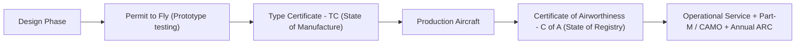

# 010 Air Law | Chapter 2: Airworthiness of Aircraft

| Document Data | Specification |
| :--- | :--- |
| **Subject** | 010 Air Law (EASA ATPL) |
| **CAE Oxford Manual** | Chapter 2 (Pages 53 – 58) |
| **Difficulty Level** | 🟡 Medium (Core regulatory definitions, responsibilities) |
| **Exam Weighting** | ⭐⭐ High (Consistent questions on C of A, ADs, and issuing authorities) |
| **Target Score** | ≥ 90% in AviationExam Mock Tests |
| **PDF Summary File** | [`010_ch02_airworthiness.pdf`](file:///Users/fernandochozasaliseda/Desktop/PROYECTO%20ATPL/resumenes/convocatoria_1/010_air_law/010_ch02_airworthiness.pdf) |

---

## 1. Regulatory Framework: Annex 8 vs Annex 6

Airworthiness is the intrinsic safety of an aircraft:
* **Annex 8 (Airworthiness of Aircraft)**: Covers engineering, design, structural integrity, flight characteristics, powerplant reliability, and continuing airworthiness.
* **Annex 6 (Operation of Aircraft)**: Covers operational standards, minimum safety equipment, and operating limitations.

> **Annex 8 Applicability Scope (EASA Core Rule)**:
> The international Standards of Annex 8 Part III apply to aeroplanes with a certified **Maximum Take-Off Mass (MTOM) greater than 5,700 kg**, powered by at least **two engines**, and intended for the international commercial carriage of passengers, cargo, or mail.
> *EASA Equivalent: Certification Specifications (CS-23 for light aircraft, CS-25 for large aeroplanes, CS-27/29 for rotorcraft, CS-E for engines, CS-P for propellers).*

---

## 2. The Aircraft Certification Chain

1. **Permit to Fly**:
   * Issued for aircraft that do not currently meet airworthiness standards but are capable of safe flight (e.g. flight testing prototypes, ferrying an aircraft to a maintenance base).
2. **Type Certificate (TC)**:
   * Issued by the **State of Design / Manufacture** (e.g. France for Airbus, USA for Boeing).
   * Certifies that the aircraft type/model design meets the airworthiness code.
3. **Supplemental Type Certificate (STC)**:
   * Issued when an organization other than the original manufacturer modifies an existing certified aircraft type with major design changes (e.g. winglets, new avionics suite).
4. **Certificate of Airworthiness (C of A)**:
   * Issued to **each individual serial-numbered aircraft** by the **State of Registry** when satisfactory evidence is provided that it conforms to the approved Type Certificate and is in condition for safe operation.

---

## 3. Certificate of Airworthiness (C of A) Essentials

* **Mandatory Onboard Document**: Required by Article 29 of the Chicago Convention.
* **Mandatory Information Stated on C of A**:
  1. Nationality and registration marks.
  2. Manufacturer and manufacturer's designation of aircraft (e.g. Airbus A320-200).
  3. Aircraft serial number (airframe chassis number).
  4. Categories / operational limitations.
  5. State of Registry signature and official stamp.
* **Mutual Recognition (Article 33)**: Other Contracting States must recognize the C of A, provided requirements equal or exceed minimum ICAO Annex 8 standards.

---

## 4. Continuing Airworthiness & Maintenance

An aircraft is only airworthy if maintained according to strict rules throughout its service life:

| Document / Tool | Legal Character | Purpose & AviationExam Core |
| :--- | :---: | :--- |
| **Airworthiness Directive (AD)** | **MANDATORY** | Issued by the aviation authority (e.g. EASA or FAA) when an unsafe condition is discovered in a type. Must be complied with within the specified timeframe. Non-compliance immediately suspends/invalidates the C of A. |
| **Service Bulletin (SB)** | **NON-MANDATORY** *(by default)* | Issued by the manufacturer (Boeing, Airbus) recommending maintenance enhancements. Only becomes mandatory if formally mandated by an Airworthiness Directive (AD). |
| **Maintenance Programme** | **MANDATORY** | Approved schedule of maintenance inspections (daily, A-check, C-check, D-check overhaul) tailored to the aircraft and operations. |
| **Certificate of Release to Service (CRS)** | **MANDATORY** | Issued by authorized Part-145 certifying staff after any maintenance, overhaul, or modification before the aircraft is permitted to fly. |
| **Airworthiness Review Certificate (ARC)** | **MANDATORY** *(EASA)* | Under EASA Part-M/CAMO, the C of A has unlimited duration, but is valid ONLY when accompanied by a valid ARC (EASA Form 15), renewed every 12 months. |

---

## 5. ⚠️ AviationExam Traps

> [!WARNING]
> **Trap 1: Who issues the Type Certificate vs the C of A?**
> * *Type Certificate*: Issued by the **State of Design / Manufacture**.
> * *Certificate of Airworthiness*: Issued by the **State of Registry**.

> [!WARNING]
> **Trap 2: Is a manufacturer's Service Bulletin mandatory?**
> * *Answer*: **NO**. It is informational/advisory. It becomes legally mandatory **ONLY IF** an Airworthiness Directive (AD) is issued by the regulatory authority referencing that SB.

> [!WARNING]
> **Trap 3: Pilot-in-Command Final Responsibility**
> * *Answer*: The Pilot-in-Command (PIC) is ultimately responsible for ensuring the aircraft is safe for flight and that all required documents (C of A, ARC, CRS, Journey Log) are in order before departure.
