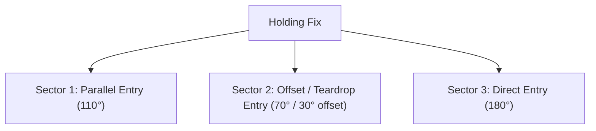

# 010 Air Law | Chapter 9: Holding Procedures (PANS-OPS)

| Document Data | Specification |
| :--- | :--- |
| **Subject** | 010 Air Law (EASA ATPL) |
| **CAE Oxford Manual** | Chapter 9 (Pages 215 – 226) |
| **Difficulty Level** | 🔴 High (Speeds, outbound timings, 3 entry sectors, buffers) |
| **Exam Weighting** | ⭐⭐⭐ Critical (One of the most examined chapters in 010) |
| **Target Score** | ≥ 90% in AviationExam Mock Tests |
| **PDF Summary File** | [`010_ch09_holding_procedures.pdf`](file:///Users/fernandochozasaliseda/Desktop/PROYECTO%20ATPL/resumenes/convocatoria_1/010_air_law/010_ch09_holding_procedures.pdf) |

---

## 1. Holding Geometry & Rules

* Standard pattern: **Right-hand turns**. Rate of turn: **3°/sec** or **25° bank** (whichever is less).
* **Outbound Leg Timing**:
  * Up to and including 14,000 ft: **1 minute**.
  * Above 14,000 ft: **1.5 minutes**.

---

## 2. Maximum Holding Speeds (PANS-OPS)

| Altitude Band | Normal Speed | Turbulence Conditions |
| :--- | :---: | :---: |
| **Up to 14,000 ft** | **230 kt** *(Cat A/B: 170 kt)* | **280 kt** (or 0.8M) |
| **14,000 ft to 20,000 ft** | **240 kt** | **280 kt** (or 0.8M) |
| **20,000 ft to 34,000 ft** | **265 kt** | **280 kt** (or 0.8M) |
| **Above 34,000 ft** | **0.83 Mach** | **0.83 Mach** |

---

## 3. The 3 Entry Sectors

* **Sector 1 (Parallel)**: 110°.
* **Sector 2 (Offset)**: 70° (fly 30° offset).
* **Sector 3 (Direct)**: 180°.
* **Sector Buffer**: **5°** flexibility on each side of the boundary lines.

---

## 4. Minimum Obstacle Clearance (MOC)

* **Primary Area**: **300 m (1,000 ft)** over flat terrain; **600 m (2,000 ft)** over mountainous terrain.
* **Buffer Area**: Extends **5 NM** around the primary area. MOC reduces to zero at outer edge.
