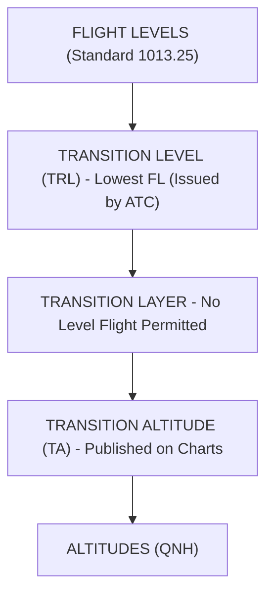

# 010 Air Law | Chapter 10: Altimeter Setting Procedures

| Document Data | Specification |
| :--- | :--- |
| **Subject** | 010 Air Law (EASA ATPL) |
| **CAE Oxford Manual** | Chapter 10 (Pages 227 – 238) |
| **Difficulty Level** | 🟡 Medium (Pressure settings, TA/TRL changeover rules) |
| **Exam Weighting** | ⭐⭐⭐ Critical (Tested in Air Law, Met, and Flight Planning) |
| **Target Score** | ≥ 90% in AviationExam Mock Tests |
| **PDF Summary File** | [`010_ch10_altimeter_setting.pdf`](file:///Users/fernandochozasaliseda/Desktop/PROYECTO%20ATPL/resumenes/convocatoria_1/010_air_law/010_ch10_altimeter_setting.pdf) |

---

## 1. Pressure Settings

* **QNH**: Station pressure reduced to sea level. Indicates **Altitude** above MSL. On ground: indicates **aerodrome elevation**.
* **QFE**: Station pressure at aerodrome elevation. Indicates **Height** above aerodrome. On ground: indicates **ZERO**.
* **Standard (1013.25 hPa)**: Indicates **Flight Level (FL)**.

---

## 2. Transition Altitude, Level & Layer

* **Climbing**: Change from QNH to 1013.25 hPa when passing **Transition Altitude (TA)**.
* **Descending**: Change from 1013.25 hPa to QNH when passing **Transition Level (TRL)**.
* **Level flight within the Transition Layer is PROHIBITED**.

---

## 3. ⚠️ AviationExam Traps

> [!WARNING]
> **Trap: When is the altimeter changed during descent?**
> * *Answer*: Passing the **Transition Level (TRL)**, as advised by ATC.
