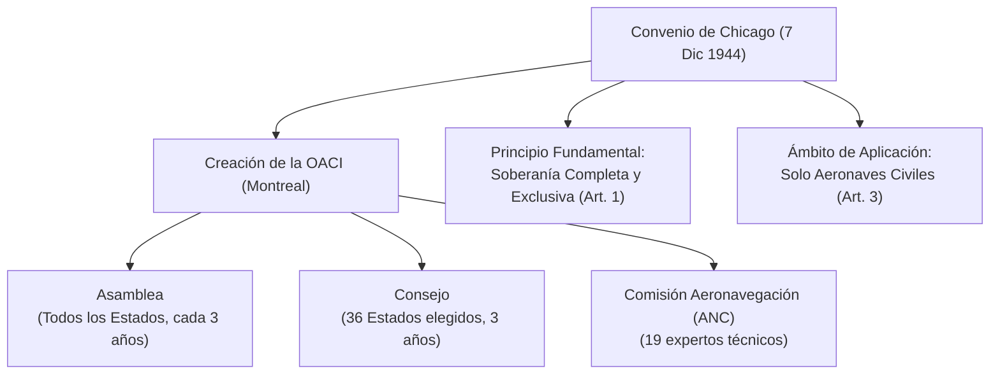
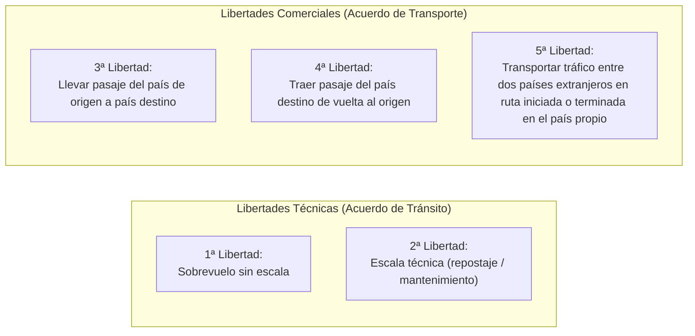

# 010 Air Law | Tema 1: Convenio de Chicago, OACI y Acuerdos Internacionales

| Ficha Técnica | Detalle |
| :--- | :--- |
| **Asignatura** | 010 Air Law (Derecho Aéreo) |
| **Manual CAE Oxford** | Capítulo 1 (Páginas 21 – 52) |
| **Dificultad EASA** | 🔴 Alta (Alta densidad de artículos y preguntas trampa de banco) |
| **Prioridad en Examen** | ⭐⭐⭐ (Preguntas seguras en cada examen de AviationExam) |
| **Objetivo de Acierto** | ≥ 90% en simulacros de AviationExam |

---

## 1. Fundamentos Conceptuales (Fase 1: Comprender)

El Derecho Aeronáutico Internacional moderno nace para resolver un conflicto fundamental: **la soberanía del espacio aéreo frente a la necesidad de libre circulación del transporte comercial.**

Antes del Convenio de Chicago existían discrepancias entre convenios previos (París 1919, La Habana 1928). Durante la Segunda Guerra Mundial, la aviación civil experimentó un salto tecnológico masivo y se hizo urgente establecer un estándar unificado para comunicaciones, licencias, normas de vuelo y aeronavegabilidad a escala global.



---

## 2. Artículos Críticos del Convenio de Chicago (Fase 2: Datos EASA)

Los exámenes de EASA y las preguntas de AviationExam preguntan números de artículos específicos. Memoriza esta tabla:

| Artículo | Título / Concepto | Regla Clave EASA / Trampa Frecuente |
| :---: | :--- | :--- |
| **Art. 1** | **Soberanía** | Cada Estado tiene soberanía **completa y exclusiva** sobre el espacio aéreo sobre su territorio (incluidas sus aguas territoriales). |
| **Art. 2** | **Territorio** | La tierra y las aguas territoriales adyacentes bajo la soberanía, jurisdicción o mandato del Estado. *(El espacio aéreo sobre alta mar NO es territorio de ningún Estado)*. |
| **Art. 3** | **Aeronaves Civiles y de Estado** | El convenio aplica **ÚNICAMENTE a aeronaves civiles**. Se consideran aeronaves de Estado las utilizadas en servicios **militares, aduanas y policía**. Una aeronave de Estado no puede sobrevolar ni aterrizar sin autorización previa especial. |
| **Art. 4** | **Uso indebido de la aviación** | Prohibición de usar la aviación civil para propósitos incompatibles con los fines del convenio. |
| **Art. 5** | **Vuelos no regulares** | Las aeronaves civiles que no operen servicios regulares tienen derecho a sobrevolar y hacer escalas técnicas sin permiso previo, sujeto al derecho del Estado de exigir aterrizaje. |
| **Art. 7** | **Cabotaje** | Cada Estado contratante tiene derecho a **denegar** a aeronaves de otros Estados permiso para transportar pasajeros/carga de pago entre dos puntos de su propio territorio. |
| **Art. 10** | **Aeropuertos aduaneros** | Los Estados pueden exigir que las aeronaves que entren en su territorio aterricen en un aeropuerto designado como aduanero/fronterizo. |
| **Art. 12** | **Reglas del Aire** | Cada Estado se compromete a que las aeronaves cumplan las normas locales en su territorio y las normas de la OACI sobre **Alta Mar**. Sobre alta mar aplican las reglas OACI sin excepción. |
| **Art. 16** | **Inspección de Aeronaves** | Las autoridades competentes tienen derecho a registrar las aeronaves de otros Estados al aterrizar o despegar sin demoras innecesarias. |
| **Art. 29** | **Documentos a bordo** | Certificado de Matrícula, Certificado de Aeronavegabilidad, Licencias de la tripulación, Diario de a bordo (*Journey Log*), Licencia de estación de radio, Lista de pasajeros/carga. |
| **Art. 32** | **Licencias del personal** | El piloto y la tripulación deben tener licencias válidas emitidas o convalidadas por el **Estado de Matrícula** (*State of Registry*). |
| **Art. 33** | **Reconocimiento de certificados** | Los certificados de aeronavegabilidad y licencias emitidos por el Estado de matrícula deben ser reconocidos por los demás Estados, **siempre que los requisitos sean iguales o superiores a los estándares mínimos OACI**. |
| **Art. 37** | **Adopción de normas (SARPs)** | La OACI adopta Normas y Métodos Recomendados Internacionales en forma de **Anexos**. |
| **Art. 38** | **Notificación de Diferencias** | Si un Estado no puede cumplir una Norma Internacional (*Standard*), **DEBE notificar inmediatamente a la OACI la diferencia** entre su regulación nacional y la norma OACI. |

---

## 3. Las Libertades del Aire (*Freedoms of the Air*)

Pregunta clásica indispensable en el banco de AviationExam:



### Detalle de las 5 Libertades Básicas y Extendidas:
1. **1ª Libertad**: El derecho a sobrevolar el territorio de otro Estado sin aterrizar.
2. **2ª Libertad**: El derecho a aterrizar en otro Estado para fines no comerciales (escala técnica, repostaje, avería).
3. **3ª Libertad**: El derecho a desembarcar pasajeros, correo y carga embarcados en el Estado de matrícula de la aeronave.
4. **4ª Libertad**: El derecho a embarcar pasajeros, correo y carga con destino al Estado de matrícula de la aeronave.
5. **5ª Libertad**: El derecho a transportar pasajeros/carga entre dos Estados extranjeros en un vuelo que **comienza o termina** en el país de la aerolínea (ejemplo: Iberia opera Madrid → París → Tokio con derechos de tráfico comercial entre París y Tokio).
6. **6ª Libertad**: Transporte entre dos países extranjeros haciendo escala en el país de la aerolínea (ejemplo: Emirates llevando pasaje Londres → Dubái → Sídney).
7. **8ª Libertad (Cabotaje consecutivo)**: Operar vuelos entre dos puntos del mismo país extranjero como continuación de un vuelo internacional.
8. **9ª Libertad (Cabotaje puro / Stand-alone)**: Operar rutas domésticas dentro de un país extranjero sin conexión con el país de origen.

---

## 4. Estructura y Funcionamiento de la OACI

* **Sede permanente**: **Montreal (Canadá)**.
* **Asamblea**:
  * Órgano soberano formado por **todos los Estados contratantes**.
  * Se reúne al menos **una vez cada 3 años**.
  * Cada Estado tiene **1 voto**. Aprueba presupuestos y elige a los miembros del Consejo.
* **Consejo**:
  * Órgano ejecutivo y permanente, responsable ante la Asamblea.
  * Compuesto por **36 Estados contratantes**, elegidos por un mandato de **3 años**.
  * Es quien **adopta formalmente los Anexos** (requiere 2/3 de los votos del Consejo).
* **Comisión de Aeronavegación (ANC - *Air Navigation Commission*)**:
  * Formada por **19 personas expertas**, independientes y nombradas por el Consejo.

### Estándares vs Métodos Recomendados (SARPs):
* **Norma Internacional (*Standard*)**: Especificación física, configuración o procedimiento cuya aplicación uniforme se considera **necesaria** para la seguridad. **Obligatoria**; si un Estado no la cumple, debe emitir una Notificación de Diferencias (Art. 38).
* **Método Recomendado (*Recommended Practice*)**: Especificación cuya aplicación uniforme se considera **conveniente/deseable**. No es estrictamente obligatoria.

---

## 5. Tabla Maestra de los 19 Anexos OACI

> [!TIP]
> En AviationExam suelen preguntar directamente: *"Which ICAO Annex deals with Search and Rescue?"* o *"Rules of the Air is covered in Annex...?"*

| Anexo | Título Oficial OACI | Materia Clave |
| :---: | :--- | :--- |
| **1** | **Personnel Licensing** | Licencias FCL, habilitaciones, certificados médicos (Clase 1, 2, LAPL). |
| **2** | **Rules of the Air** | Reglas generales, VFR, IFR, luces, señales, intercepción. |
| **3** | **Meteorological Service** | METAR, TAF, SIGMET, oficinas meteorológicas. |
| **4** | **Aeronautical Charts** | Cartas de aproximación, salida SID, STAR, en ruta, escala WAC. |
| **5** | **Units of Measurement** | Sistema Internacional (SI) y unidades temporales (pies, nudos, NM). |
| **6** | **Operation of Aircraft** | Parte I (Comercial), Parte II (General), Parte III (Helicópteros). |
| **7** | **Aircraft Nationality and Marks** | Letras de matrícula, banderas, emplazamiento en alas/fuselaje. |
| **8** | **Airworthiness of Aircraft** | Certificados de tipo y de aeronavegabilidad. |
| **9** | **Facilitation** | Trámites aduaneros, inmigración, despacho rápido de pasaje. |
| **10** | **Aeronautical Telecommunications** | Volúmenes I a V (Radioayudas, radar, frecuencias, voz y datos). |
| **11** | **Air Traffic Services** | ATC (Control), FIS (Información), ALRS (Alerta), clases de espacio aéreo. |
| **12** | **Search and Rescue (SAR)** | Fases de emergencia: INCERFA, ALERFA, DETRESFA. |
| **13** | **Aircraft Accident Investigation** | Definición de accidente e incidente grave; único objetivo: prevención. |
| **14** | **Aerodromes** | Vol. I (Diseño y operaciones de pistas/calles), Vol. II (Helipuertos). |
| **15** | **Aeronautical Information Services** | AIP, NOTAM, SNOWTAM, ASHTAM, AIC, circulares. |
| **16** | **Environmental Protection** | Ruido de aeronaves y emisiones de motores. |
| **17** | **Security** | Protección de la aviación civil contra actos de interferencia ilícita. |
| **18** | **Safe Transport of Dangerous Goods** | Mercancías peligrosas por vía aérea (DGR, etiquetas, embalaje). |
| **19** | **Safety Management** | SMS (*Safety Management System*) y programas estatales SSP. |

---

## 6. Convenios Internacionales Complementarios

* **Convenio de Tokio (1963)**: Actos cometidos a bordo de aeronaves. Establece la jurisdicción del **Estado de matrícula** y otorga **autoridad plena al Comandante** para desembarcar o inmovilizar a cualquier persona que amenace la seguridad del vuelo.
* **Convenio de La Haya (1970)**: Represión del apoderamiento ilícito de aeronaves (**Secuestro aéreo / *Hijacking***). Obliga a los Estados a extraditar o juzgar al delincuente con penas severas.
* **Convenio de Montreal (1971)**: Represión de actos ilícitos contra la seguridad de la aviación civil (**Sabotaje**, bombas en aeronaves o daños a instalaciones de navegación).
* **Convenio de Varsovia (1929) / Montreal (1999)**: Responsabilidad del transportista aéreo frente a los pasajeros por daños, lesiones, retrasos o pérdida de equipaje/carga.

---

## 7. ⚠️ Exam Traps (Trampas Típicas de AviationExam)

> [!WARNING]
> **Trampa 1: ¿A quién aplica el Convenio de Chicago?**
> * *Pregunta*: "¿Aplica el Convenio de Chicago a los aviones de aduanas o policía si están desarmados?"
> * *Respuesta*: **NO**. El Art. 3 excluye explícitamente a las aeronaves militares, de aduanas y de policía, catalogándolas como "Aeronaves de Estado" (*State Aircraft*), independientemente de su armamento.

> [!WARNING]
> **Trampa 2: Soberanía en Alta Mar**
> * *Pregunta*: "¿Qué reglas del aire se aplican sobre Alta Mar (*High Seas*)?"
> * *Respuesta*: **Las Reglas del Aire establecidas por la OACI (Anexo 2) sin modificación alguna**. Ningún Estado puede aplicar sus reglas nacionales sobre alta mar; el Art. 12 establece que sobre alta mar la autoridad normativa exclusiva es la OACI.

> [!WARNING]
> **Trampa 3: ¿Quién aprueba los Anexos de la OACI?**
> * *Pregunta*: "¿Los Anexos de la OACI son aprobados por la Asamblea o por el Consejo?"
> * *Respuesta*: Por el **CONSEJO** (*Council*) mediante el voto favorable de dos tercios de sus 36 miembros. La Asamblea los revisa en sus sesiones trienales, pero la adopción legal de las enmiendas es competencia del Consejo.

> [!WARNING]
> **Trampa 4: Reconocimiento de Licencias (Art. 33)**
> * *Pregunta*: "¿Está obligado un Estado contratante a reconocer una licencia emitida por otro Estado si este último tiene requisitos inferiores a la OACI?"
> * *Respuesta*: **NO**. Solo está obligado si los requisitos del Estado emisor son **iguales o superiores** a los estándares mínimos de la OACI.

---

## 8. Checklist de Autoevaluación Rápida (Fase 4: Flash Check)

Antes de abrir el banco de preguntas en AviationExam, comprueba que sabes responder a estas preguntas sin mirar los apuntes:

1. ¿Cuántos Estados componen el Consejo de la OACI y cuánto dura su mandato? *(R: 36 Estados, 3 años)*.
2. ¿Qué diferencia legal existe entre una Norma (*Standard*) y un Método Recomendado (*Recommended Practice*)?
3. Si un avión comercial vuela de Madrid a París y luego continúa a Fráncfort recogiendo pasajeros de pago en París hacia Fráncfort, ¿qué libertad del aire ejerce? *(R: 5ª Libertad)*.
4. ¿Qué número de Anexo OACI corresponde a Investigación de Accidentes e Incidentes? *(R: Anexo 13)*.
5. ¿Qué convenio otorga al comandante de la aeronave la potestad legal de inmovilizar a un pasajero perturbador a bordo? *(R: Convenio de Tokio de 1963)*.
6. ¿Qué artículo del Convenio de Chicago obliga a un Estado a notificar si no cumple una norma OACI? *(R: Artículo 38 - Diferencias)*.

---

### Siguiente Paso Recomendado:
Ejecuta tu primer test en AviationExam sobre este tema:
```bash
python3 database/study_manager.py registrar-test --tema 1 --aciertos [TUS_ACIERTOS] --total [TOTAL_PREGUNTAS]
```
